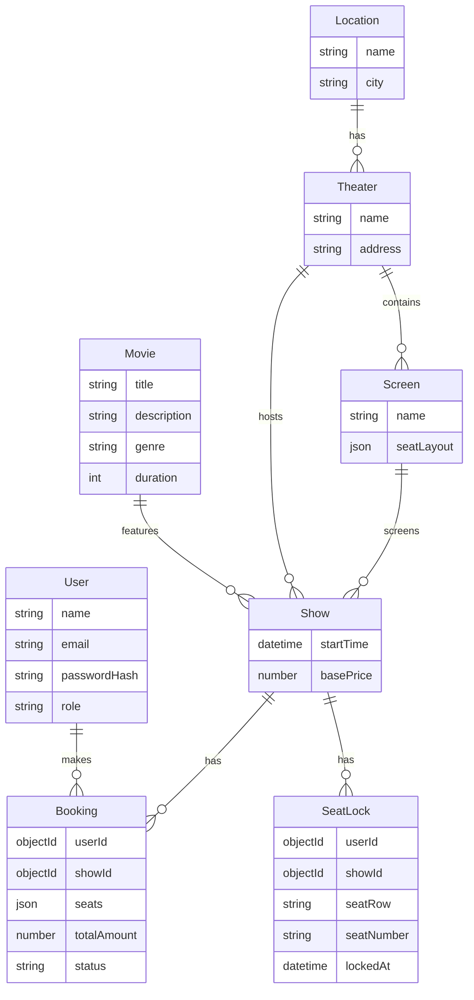

# BookMyShow Clone

A robust, microservices-oriented ticket booking application designed to handle high-concurrency scenarios, featuring a virtual waiting room and distributed service architecture.

## 🚀 Features

### Core Booking
- **Movie Catalog**: Browse movies, theaters, and showtimes across different cities.
- **Interactive Seat Selection**: Real-time visual seat map with different seat types (Standard, VIP).
- **Seat Locking**: Concurrency handling with 10-minute temporary seat locks to prevent double booking.
- **Payment Simulation**: Component for processing payments and confirming bookings.

### Advanced System Features
- **Virtual Waiting Room**: Automatic queue system for high-demand bookings. Limits traffic surges using token-based validation.
- **Microservices Architecture**: Separation of concerns with distinct services for Auth, Catalog, Booking, Payment, Notification, and Admin.
- **API Gateway**: Centralized entry point routing requests to appropriate backend services.
- **Admin Dashboard**: Interface for managing movies, screens, and schedules.

## 🏗 Architecture

The application handles high scale through a modular design where services run as separate processes (concurrently in development).

- **Frontend**: React.js with TypeScript and Tailwind CSS.
- **Backend**: Node.js microservices with Express.
- **Database**: MongoDB with Mongoose for object modeling.
- **Communication**: Services interact via HTTP REST through the API Gateway or direct calls.

### Service Map
| Service | Port | Description |
|---------|------|-------------|
| **Gateway** | 3000 | Entry point, Queue middleware, Router |
| **Catalog** | 3001 | Movies, Theaters, Shows management |
| **Booking** | 3002 | Booking logic, Seat Locking mechanism |
| **Payment** | 3003 | Payment processing stub |
| **User** | 3004 | Authentication (JWT), User Profiles |
| **Waiting Room** | 3005 | Token generation, Queue management |
| **Admin** | 3006 | Admin operations and seeding |

### System Architecture
```mermaid
graph TD
    Client[Client UI (React)] -->|HTTP/REST| Gateway[API Gateway :3000]
    
    subgraph Microservices
        Gateway -->|Proxy| Catalog[Catalog Service :3001]
        Gateway -->|Proxy| Booking[Booking Service :3002]
        Gateway -->|Proxy| Payment[Payment Service :3003]
        Gateway -->|Proxy| User[User Service :3004]
        Gateway -->|Proxy| Admin[Admin Service :3006]
        Gateway -->|Proxy| WaitingRoom[Waiting Room Service :3005]
    end

    subgraph Infrastructure
        DB[(MongoDB)]
    end

    Catalog --> DB
    Booking --> DB
    Payment --> DB
    User --> DB
    Admin --> DB
    WaitingRoom --> DB
    
    Client -.->|Redirect if Busy| WaitingRoom
```

## 💾 Database Schema

The application uses MongoDB with the following core collections spread across service boundaries:

### Entity Relationship Diagram


### User Service
- **User**: Stores `name`, `email`, `passwordHash`, `role` (user/admin).

### Catalog Service
- **Movie**: `title`, `description`, `genre`, `posterUrl`, `duration`.
- **Location**: `name`, `city`.
- **Theater**: `name`, `address`, links to `Location`.
- **Screen**: `name`, `theaterId`, `seatLayout` (JSON structure for rows/seats), links to `Theater`.
- **Show**: `startTime`, `basePrice`, links to `Movie`, `Theater`, `Screen`.

### Booking Service
- **Booking**: Tracks `userId`, `showId`, `seats` (array), `totalAmount`, `status` (`PENDING`, `CONFIRMED`, `CANCELLED`).
- **SeatLock**: Temporary locks with `showId`, `seatRow`, `seatNumber`, `userId`, `lockedAt` (TTL: 10 mins).

### Waiting Room Service
- **QueueItem**: Manages `userId`, `token`, `status` (`WAITING`, `ACTIVE`), `activeUntil`.

## 🛠 Getting Started

### Prerequisites
- Node.js (v16+)
- Docker & Docker Compose (for MongoDB)

### Installation

1. **Start Database**
   ```bash
   docker-compose up -d
   ```

2. **Install Dependencies**
   ```bash
   # Install Server Dependencies
   cd server
   npm install

   # Install Client Dependencies
   cd ../client
   npm install
   ```

### Running the Application

1. **Start Backend Services**
   The backend runs all microservices concurrently via a single command.
   ```bash
   cd server
   npm run dev
   ```
   *The API Gateway will start on **Port 3000**.*

2. **Start Frontend**
   ```bash
   cd client
   npm start
   ```
   **Note**: Since the Gateway uses port 3000, React will detect the port is in use and prompt you to run on another port (usually **3001**). Type `Y` to confirm.

3. **Access the App**
   - Frontend: `http://localhost:3001` (or whatever port React selected)
   - API Gateway: `http://localhost:3000`
